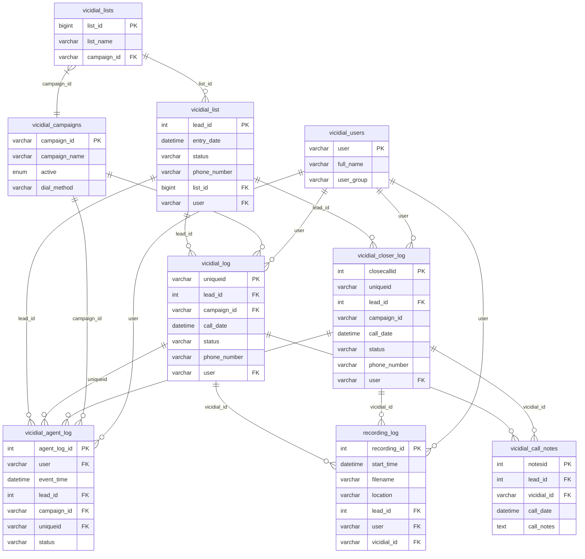
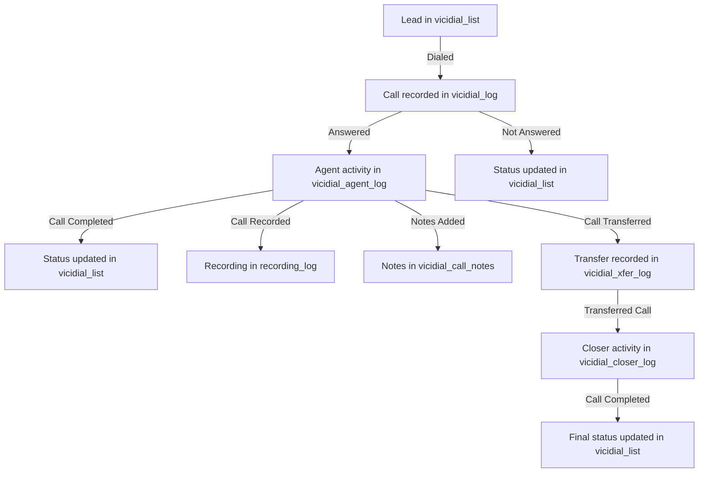
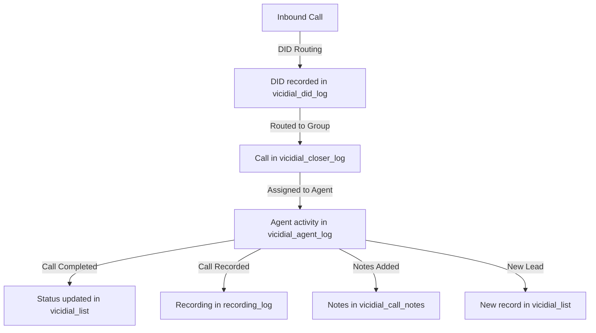
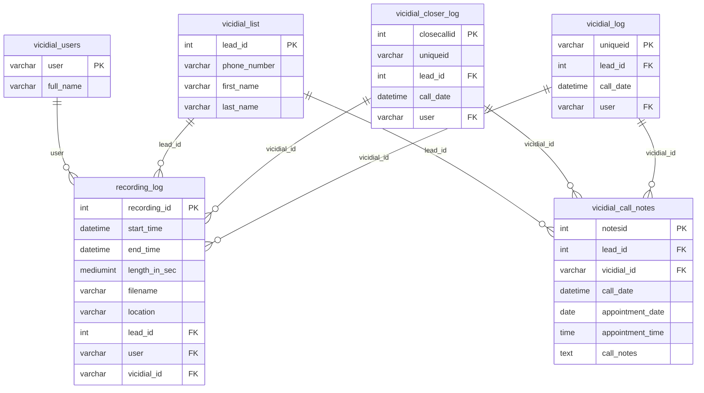
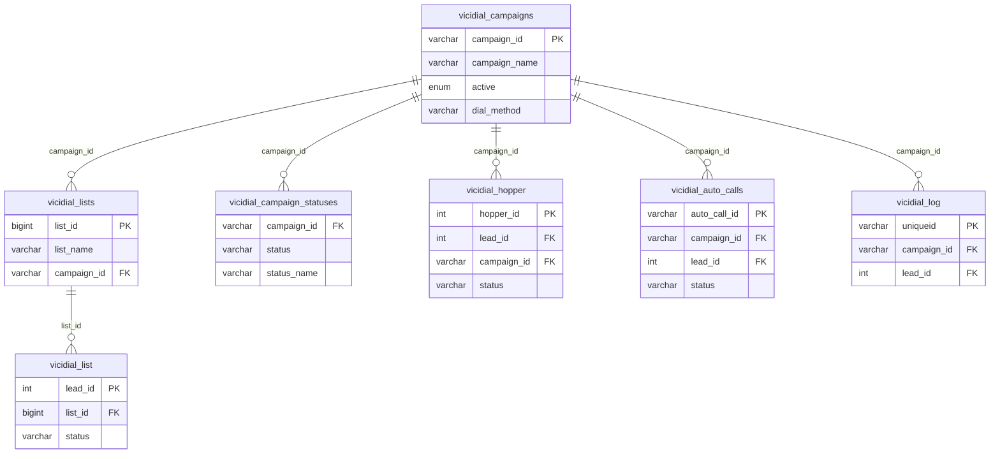
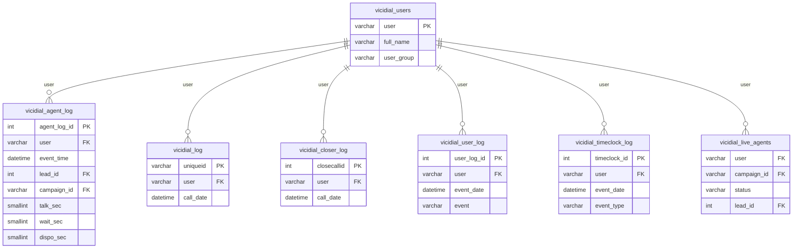
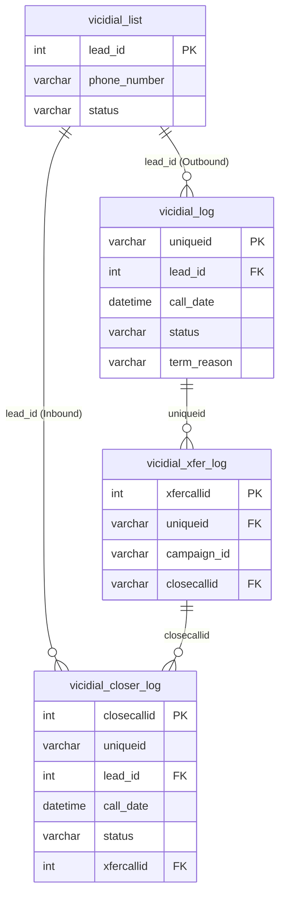

# Database Diagram

This document provides a visual representation of the key tables in the ViciDial database and their relationships.

## Core Tables and Relationships

## Call Flow Diagrams

### Outbound Call Flow

### Inbound Call Flow

## Call Recording and Documentation

## Campaign Configuration Relationships

## Agent Activity Tracking

## Inbound and Outbound Call Relationship

## Notes on the Diagrams

1. These diagrams focus on the core tables and their primary relationships. The actual database contains many more tables and relationships.

2. The entity-relationship diagrams (ERD) show the key fields and relationships between tables, while the flowcharts illustrate the logical flow of data through the system.

3. Cardinality notation:
   - `||--o{` indicates a one-to-many relationship
   - `}|--||` indicates a many-to-one relationship
   - `||--||` would indicate a one-to-one relationship (not shown in these diagrams)
   - `}|--|{` would indicate a many-to-many relationship (not shown in these diagrams)

4. Primary keys are marked with PK, and foreign keys with FK.

5. These diagrams can be rendered using any tool that supports Mermaid markdown syntax.

6. The diagrams highlight the distinction between outbound calls (`vicidial_log`) and inbound calls (`vicidial_closer_log`), and how they relate to recordings, notes, and agent activity.
