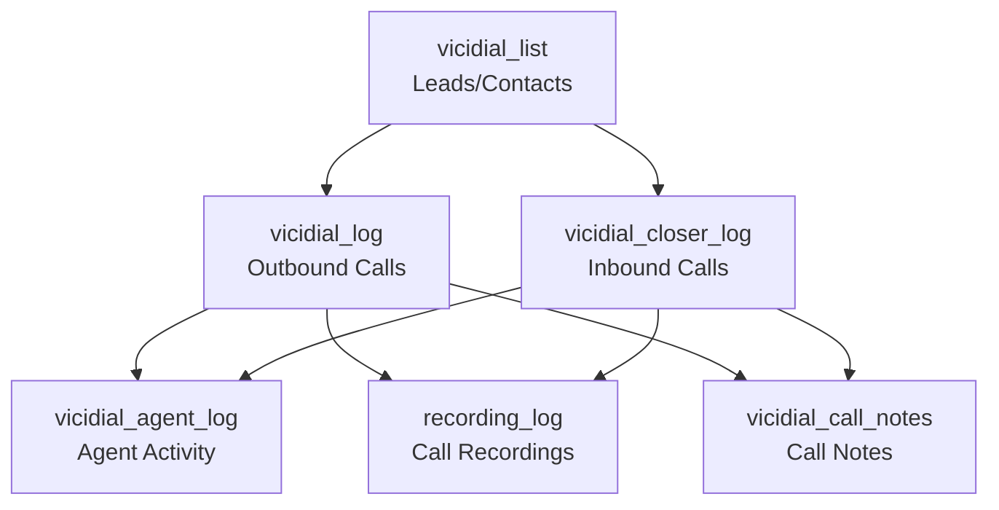

# Table Relationships

This document outlines the relationships between tables in the ViciDial database, focusing on how tables can be joined to produce meaningful results.

## Core Relationships

### Call Data Flow

The database tracks the flow of calls through the system, with relationships between leads, agents, call logs, recordings, and notes:



### Key Join Fields

| Relationship | Primary Table | Primary Key | Foreign Table | Foreign Key |
|--------------|--------------|-------------|---------------|-------------|
| Leads to Outbound Calls | vicidial_list | lead_id | vicidial_log | lead_id |
| Leads to Inbound Calls | vicidial_list | lead_id | vicidial_closer_log | lead_id |
| Leads to Agent Activity | vicidial_list | lead_id | vicidial_agent_log | lead_id |
| Outbound Calls to Agent Activity | vicidial_log | uniqueid | vicidial_agent_log | uniqueid |
| Inbound Calls to Agent Activity | vicidial_closer_log | uniqueid | vicidial_agent_log | uniqueid |
| Outbound Calls to Recordings | vicidial_log | uniqueid | recording_log | vicidial_id |
| Inbound Calls to Recordings | vicidial_closer_log | uniqueid | recording_log | vicidial_id |
| Outbound Calls to Notes | vicidial_log | uniqueid | vicidial_call_notes | vicidial_id |
| Inbound Calls to Notes | vicidial_closer_log | uniqueid | vicidial_call_notes | vicidial_id |
| Campaigns to Outbound Calls | vicidial_campaigns | campaign_id | vicidial_log | campaign_id |
| Campaigns to Agent Activity | vicidial_campaigns | campaign_id | vicidial_agent_log | campaign_id |

## Common Join Patterns

### Tracking Call Outcomes (Outbound)

To track the outcome of outbound calls for specific leads:

```sql
SELECT 
    vl.lead_id,
    vl.first_name,
    vl.last_name,
    vl.phone_number,
    vlog.call_date,
    vlog.status,
    vlog.length_in_sec
FROM 
    vicidial_list vl
JOIN 
    vicidial_log vlog ON vl.lead_id = vlog.lead_id
ORDER BY 
    vlog.call_date DESC;
```

### Tracking Call Outcomes (Inbound)

To track the outcome of inbound calls for specific leads:

```sql
SELECT 
    vl.lead_id,
    vl.first_name,
    vl.last_name,
    vl.phone_number,
    vcl.call_date,
    vcl.status,
    vcl.length_in_sec,
    vcl.queue_seconds
FROM 
    vicidial_list vl
JOIN 
    vicidial_closer_log vcl ON vl.lead_id = vcl.lead_id
ORDER BY 
    vcl.call_date DESC;
```

### Call Recordings Analysis

To analyze call recordings for both inbound and outbound calls:

```sql
-- Outbound call recordings
SELECT 
    vl.lead_id,
    vl.first_name,
    vl.last_name,
    vlog.call_date,
    vlog.length_in_sec AS call_length,
    rec.length_in_sec AS recording_length,
    rec.location AS recording_path,
    rec.filename
FROM 
    vicidial_list vl
JOIN 
    vicidial_log vlog ON vl.lead_id = vlog.lead_id
LEFT JOIN 
    recording_log rec ON vlog.uniqueid = rec.vicidial_id
WHERE 
    rec.recording_id IS NOT NULL
ORDER BY 
    vlog.call_date DESC;

-- Inbound call recordings
SELECT 
    vl.lead_id,
    vl.first_name,
    vl.last_name,
    vcl.call_date,
    vcl.length_in_sec AS call_length,
    rec.length_in_sec AS recording_length,
    rec.location AS recording_path,
    rec.filename
FROM 
    vicidial_list vl
JOIN 
    vicidial_closer_log vcl ON vl.lead_id = vcl.lead_id
LEFT JOIN 
    recording_log rec ON vcl.uniqueid = rec.vicidial_id
WHERE 
    rec.recording_id IS NOT NULL
ORDER BY 
    vcl.call_date DESC;
```

### Call Notes Analysis

To retrieve call notes for both inbound and outbound calls:

```sql
-- Outbound call notes
SELECT 
    vl.lead_id,
    vl.first_name,
    vl.last_name,
    vlog.call_date,
    vlog.status,
    vcn.call_notes,
    vcn.appointment_date,
    vcn.appointment_time
FROM 
    vicidial_list vl
JOIN 
    vicidial_log vlog ON vl.lead_id = vlog.lead_id
LEFT JOIN 
    vicidial_call_notes vcn ON vlog.uniqueid = vcn.vicidial_id
WHERE 
    vcn.notesid IS NOT NULL
ORDER BY 
    vlog.call_date DESC;

-- Inbound call notes
SELECT 
    vl.lead_id,
    vl.first_name,
    vl.last_name,
    vcl.call_date,
    vcl.status,
    vcn.call_notes,
    vcn.appointment_date,
    vcn.appointment_time
FROM 
    vicidial_list vl
JOIN 
    vicidial_closer_log vcl ON vl.lead_id = vcl.lead_id
LEFT JOIN 
    vicidial_call_notes vcn ON vcl.uniqueid = vcn.vicidial_id
WHERE 
    vcn.notesid IS NOT NULL
ORDER BY 
    vcl.call_date DESC;
```

### Agent Performance Metrics

To analyze agent performance across campaigns:

```sql
SELECT 
    val.user,
    vc.campaign_name,
    COUNT(val.lead_id) AS total_calls,
    SUM(val.talk_sec) AS total_talk_time,
    AVG(val.talk_sec) AS avg_talk_time
FROM 
    vicidial_agent_log val
JOIN 
    vicidial_campaigns vc ON val.campaign_id = vc.campaign_id
WHERE 
    val.event_time BETWEEN '2025-01-01' AND '2025-01-31'
GROUP BY 
    val.user, vc.campaign_name
ORDER BY 
    total_calls DESC;
```

### Campaign Performance Analysis

To analyze campaign performance:

```sql
SELECT 
    vc.campaign_id,
    vc.campaign_name,
    COUNT(vlog.lead_id) AS total_calls,
    SUM(CASE WHEN vlog.status IN ('SALE', 'XFER') THEN 1 ELSE 0 END) AS successful_calls,
    (SUM(CASE WHEN vlog.status IN ('SALE', 'XFER') THEN 1 ELSE 0 END) / COUNT(vlog.lead_id)) * 100 AS success_rate
FROM 
    vicidial_campaigns vc
JOIN 
    vicidial_log vlog ON vc.campaign_id = vlog.campaign_id
WHERE 
    vlog.call_date BETWEEN '2025-01-01' AND '2025-01-31'
GROUP BY 
    vc.campaign_id, vc.campaign_name
ORDER BY 
    success_rate DESC;
```

## Implicit Relationships

Beyond explicit foreign key relationships, there are several implicit relationships that can be used for joining tables:

1. **Phone Number Relationships**:
   - `vicidial_list.phone_number` can be joined with `vicidial_log.phone_number` or `vicidial_closer_log.phone_number`
   - `vicidial_list.alt_phone` might contain numbers that appear in call logs

2. **Time-based Relationships**:
   - `vicidial_log.call_date` or `vicidial_closer_log.call_date` can be correlated with `vicidial_agent_log.event_time`
   - `vicidial_list.last_local_call_time` can be correlated with call dates
   - `recording_log.start_time` can be correlated with call dates

3. **User/Agent Relationships**:
   - Call log `user` fields relate to `vicidial_agent_log.user`
   - `vicidial_list.user` (last modifier) might relate to agent activity

4. **Status Relationships**:
   - Call status fields might correlate with `vicidial_list.status`
   - Campaign dial status settings relate to statuses in other tables

## Multi-Table Join Examples

### Comprehensive Outbound Call Analysis

To get a comprehensive view of an outbound call, including lead information, call details, agent activity, recordings, and notes:

```sql
SELECT 
    vl.lead_id,
    vl.first_name,
    vl.last_name,
    vl.phone_number,
    vlog.call_date,
    vlog.length_in_sec,
    vlog.status AS call_status,
    vc.campaign_name,
    val.user AS agent,
    val.talk_sec,
    val.wait_sec,
    val.dispo_sec,
    rec.filename AS recording_file,
    rec.location AS recording_path,
    vcn.call_notes,
    vcn.appointment_date
FROM 
    vicidial_list vl
JOIN 
    vicidial_log vlog ON vl.lead_id = vlog.lead_id
JOIN 
    vicidial_campaigns vc ON vlog.campaign_id = vc.campaign_id
LEFT JOIN 
    vicidial_agent_log val ON vlog.uniqueid = val.uniqueid
LEFT JOIN 
    recording_log rec ON vlog.uniqueid = rec.vicidial_id
LEFT JOIN 
    vicidial_call_notes vcn ON vlog.uniqueid = vcn.vicidial_id
WHERE 
    vlog.call_date BETWEEN '2025-01-01' AND '2025-01-31'
ORDER BY 
    vlog.call_date DESC;
```

### Comprehensive Inbound Call Analysis

To get a comprehensive view of an inbound call, including lead information, call details, agent activity, recordings, and notes:

```sql
SELECT 
    vl.lead_id,
    vl.first_name,
    vl.last_name,
    vl.phone_number,
    vcl.call_date,
    vcl.length_in_sec,
    vcl.queue_seconds,
    vcl.status AS call_status,
    vcl.campaign_id AS inbound_group,
    val.user AS agent,
    val.talk_sec,
    val.wait_sec,
    val.dispo_sec,
    rec.filename AS recording_file,
    rec.location AS recording_path,
    vcn.call_notes,
    vcn.appointment_date
FROM 
    vicidial_list vl
JOIN 
    vicidial_closer_log vcl ON vl.lead_id = vcl.lead_id
LEFT JOIN 
    vicidial_agent_log val ON vcl.uniqueid = val.uniqueid
LEFT JOIN 
    recording_log rec ON vcl.uniqueid = rec.vicidial_id
LEFT JOIN 
    vicidial_call_notes vcn ON vcl.uniqueid = vcn.vicidial_id
WHERE 
    vcl.call_date BETWEEN '2025-01-01' AND '2025-01-31'
ORDER BY 
    vcl.call_date DESC;
```

### Combined Inbound and Outbound Call History

To get a complete call history for a lead, combining both inbound and outbound calls:

```sql
SELECT 
    'Outbound' AS call_type,
    vl.lead_id,
    vl.first_name,
    vl.last_name,
    vlog.call_date,
    vlog.length_in_sec,
    vlog.status,
    vlog.user AS agent,
    CASE WHEN rec.recording_id IS NOT NULL THEN 'Yes' ELSE 'No' END AS has_recording,
    CASE WHEN vcn.notesid IS NOT NULL THEN 'Yes' ELSE 'No' END AS has_notes
FROM 
    vicidial_list vl
JOIN 
    vicidial_log vlog ON vl.lead_id = vlog.lead_id
LEFT JOIN 
    recording_log rec ON vlog.uniqueid = rec.vicidial_id
LEFT JOIN 
    vicidial_call_notes vcn ON vlog.uniqueid = vcn.vicidial_id
WHERE 
    vl.lead_id = 12345  -- Replace with actual lead_id

UNION ALL

SELECT 
    'Inbound' AS call_type,
    vl.lead_id,
    vl.first_name,
    vl.last_name,
    vcl.call_date,
    vcl.length_in_sec,
    vcl.status,
    vcl.user AS agent,
    CASE WHEN rec.recording_id IS NOT NULL THEN 'Yes' ELSE 'No' END AS has_recording,
    CASE WHEN vcn.notesid IS NOT NULL THEN 'Yes' ELSE 'No' END AS has_notes
FROM 
    vicidial_list vl
JOIN 
    vicidial_closer_log vcl ON vl.lead_id = vcl.lead_id
LEFT JOIN 
    recording_log rec ON vcl.uniqueid = rec.vicidial_id
LEFT JOIN 
    vicidial_call_notes vcn ON vcl.uniqueid = vcn.vicidial_id
WHERE 
    vl.lead_id = 12345  -- Replace with actual lead_id

ORDER BY 
    call_date DESC;
```
